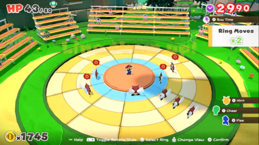

# MarioOrigamiSolver

Basic and hacky script to solve Paper Mario Origami Battle Puzzles



```
# python3 Solver.py
Enter board:
0123456789AB
000010000000
000010000000
001010010000
000101001000
Solving Board:
[[0 0 0 0 1 0 0 0 0 0 0 0]
 [0 0 0 0 1 0 0 0 0 0 0 0]
 [0 0 1 0 1 0 0 1 0 0 0 0]
 [0 0 0 1 0 1 0 0 1 0 0 0]]
Finished: 0.0608370304107666 seconds
Move Row 0 AntiClockwise by 1
Move Col 1 Outwards by 2
Final Board State:
[[0 0 0 0 1 0 0 0 0 0 0 0]
 [0 0 0 0 1 0 0 0 0 0 0 0]
 [0 1 1 0 1 0 0 0 0 0 0 0]
 [0 1 1 0 1 0 0 0 0 0 0 0]]
```

